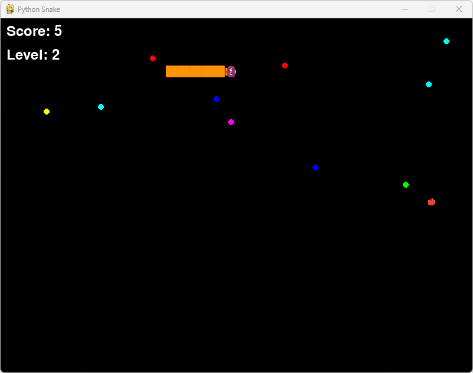

**Code Structure:**

- Main Game Loop: Handles game updates, drawing the screen, and processing player input.
- Snake Class: Manages the snake's movement, growth, and collision detection.
- Food Class: Manages the placement and rendering of food.
- Fireworks Class: Manages the fireworks display.
- PlayerAI Class: Implements AI logic to control the snake.

